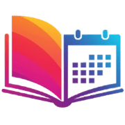

# 📚 Gerenciador de Planos de Leitura ✨

<!-- Adicione badges aqui se desejar (ex: build status, license) -->

**Nunca mais perca o fio da meada em suas leituras!** Este aplicativo web ajuda você a criar, gerenciar e acompanhar seus planos de leitura de livros de forma organizada e motivadora. Defina seus objetivos, acompanhe seu progresso e mantenha-se em dia com suas metas literárias.

**➡️ Acesse a demonstração ao vivo:** [**Gerenciador de Planos de Leitura**](https://fernnog.github.io/Plano-leitura-livros/)

---

## 🚀 Principais Funcionalidades

*   **📅 Criação Flexível de Planos:**
    *   Defina o **título**, **páginas de início e fim** do livro.
    *   Escolha o período de leitura por **datas específicas** (início e fim) ou por **número de dias** a partir de uma data de início.
    *   Selecione a **periodicidade**: leia **diariamente** ou apenas em **dias específicos da semana**.
*   **📊 Agendamento Inteligente:**
    *   O aplicativo calcula e distribui automaticamente as páginas a serem lidas em cada dia válido do seu plano.
*   **🔔 Painel de Controle Dinâmico:**
    *   **⚠️ Leituras Atrasadas:** Visualize rapidamente as **3 tarefas de leitura mais antigas** que não foram concluídas, ajudando você a priorizar e colocar a leitura em dia. (Só aparece se houver atrasos!)
    *   **🗓️ Próximas Leituras:** Veja um resumo das **3 próximas leituras agendadas**, incluindo data, título e páginas.
*   **✅ Acompanhamento de Progresso:**
    *   Marque facilmente cada dia de leitura como **concluído** com um simples clique.
    *   Visualize seu avanço com uma **barra de progresso** intuitiva.
    *   Acompanhe o **percentual concluído** e o **total de páginas lidas** vs. total do plano.
*   **🚦 Status Visual do Plano:**
    *   Identifique rapidamente o status de cada plano com tags coloridas:
        *   🔵 **Próximo:** Planos agendados para começar no futuro.
        *   🟢 **Em Dia:** Planos em andamento e sem tarefas passadas pendentes.
        *   🟠 **Atrasado:** Planos com tarefas passadas não concluídas.
        *   ⚪ **Concluído:** Todos os dias do plano foram marcados como lidos.
*   **🔄 Recálculo de Planos Atrasados:**
    *   Se um plano ficar atrasado, o app oferece opções para **recalcular o cronograma**:
        *   Definindo uma **nova data de fim**.
        *   Especificando um novo **número de páginas por dia** a partir de agora.
*   **🔗 Link para Anotações:**
    *   Adicione um **link externo** (Google Drive, Notion, etc.) a cada plano para acessar facilmente suas anotações sobre o livro.
*   **🗓️ Exportar para Agenda (.ics):**
    *   Exporte qualquer plano como um arquivo `.ics` para importar em sua agenda favorita (Google Calendar, Outlook, Apple Calendar), criando eventos recorrentes para seus horários de leitura.
*   **✏️ Gerenciamento Completo:**
    *   **Edite** os detalhes de qualquer plano existente.
    *   **Exclua** planos que não são mais necessários.
*   **☁️ Sincronização na Nuvem:**
    *   Crie sua conta ou faça login (via Email/Senha com Firebase Authentication).
    *   Seus planos são salvos automaticamente no Firebase Firestore, permitindo acesso de qualquer dispositivo.
*   **📱 Design Responsivo:**
    *   Interface adaptada para uso confortável em desktops, tablets e smartphones.

---

## ✨ Screenshots (Sugestão)

*Inclua aqui algumas imagens ou GIFs mostrando as principais telas e funcionalidades:*

1.  **Tela Principal:** Visão geral dos planos com status, painéis de Leituras Atrasadas e Próximas Leituras.
2.  **Detalhes de um Plano:** Card do plano expandido mostrando a lista de dias, progresso e opções.
3.  **Painel "Leituras Atrasadas":** Destaque para como o painel aparece quando há atrasos.
4.  **Formulário de Criação/Edição:** Mostrando as opções de data, periodicidade, etc.
5.  **Exemplo de Recálculo:** Tela do aviso de atraso com as opções.

---

## 🛠️ Tecnologias Utilizadas

*   **Frontend:** HTML5, CSS3, JavaScript (ES6 Modules)
*   **Backend & Infraestrutura:** Firebase
    *   **Autenticação:** Firebase Authentication (Email/Senha)
    *   **Banco de Dados:** Firestore (NoSQL Database)
    *   **Hospedagem:** Firebase Hosting (ou GitHub Pages)
*   **Design & Ícones:**
    *   Google Fonts (Roboto, Ubuntu)
    *   Material Symbols (Ícones)

---

## ⚙️ Como Usar

1.  Acesse o [link da aplicação](https://fernnog.github.io/Plano-leitura-livros/).
2.  **Cadastre-se** ou faça **Login** usando seu email e senha.
3.  Clique em "**Novo**" para criar seu primeiro plano de leitura, preenchendo os detalhes.
4.  Acompanhe seus planos na tela inicial. Marque os dias lidos nos detalhes de cada plano.
5.  Use os painéis **Leituras Atrasadas** e **Próximas Leituras** para se manter organizado!
6.  Exporte para a agenda ou edite seus planos conforme necessário.

---
